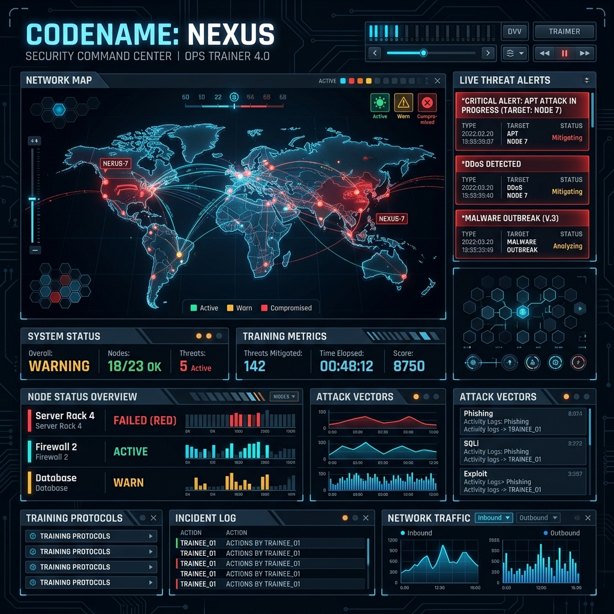

# 🛡️ Codename: Nexus



**Codename: Nexus** is a state-of-the-art, immersive **Cybersecurity Training Simulation** designed to put incident responders and security analysts in the heat of a simulated attack. Built with a modern Windows-inspired desktop environment, it provides a realistic playground for identifying, analyzing, and mitigating sophisticated cyber threats.

---

## 🚀 Experience the Frontlines

Nexus isn't just a dashboard; it's a full-blown OS simulation. Experience the chaos of a breach through a responsive, interactive interface that mimics real-world enterprise systems.

### ✨ Key Features

- **🖥️ Full OS Simulation**: A familiar desktop environment with icons, taskbar, start menu, and window management.
- **⚠️ Dynamic Attack Scenarios**:
  - **Ransomware**: Visual system lockouts with emergency response protocols.
  - **Malware/Worms**: Glitch effects and "teleporting" malicious files.
  - **DDoS**: Real-time network instability indicators.
  - **Data Exfiltration**: Unauthorized data transfer alerts and forensic breadcrumbs.
- **📊 Incident Response Dashboard**: A dedicated command center to manage active threats, view logs, and coordinate resolutions.
- **🐉 Kali Linux Forensics Mode**: Switch to a specialized Linux-inspired environment for deep-dive investigation and terminal-based workflows.
- **🎮 Gamified Sessions**: Track your progress through "shifts," complete with reporting and performance evaluation.

---

## 🛠️ Tech Stack

Built with cutting-edge web technologies for performance and visual fidelity:

- **Frontend**: [React 19](https://reactjs.org/)
- **Build Tool**: [Vite](https://vitejs.dev/)
- **Styling**: [Tailwind CSS](https://tailwindcss.com/)
- **Icons**: [Lucide React](https://lucide.dev/)
- **Language**: [TypeScript](https://www.typescriptlang.org/)

---

## ⚙️ Getting Started

### Prerequisites

- [Node.js](https://nodejs.org/) (v18+ recommended)
- [npm](https://www.npmjs.com/) or [yarn](https://yarnpkg.com/)

### Installation

1. **Clone the repository**:
   ```bash
   git clone https://github.com/your-username/codename-nexus.git
   cd codename-nexus
   ```

2. **Install dependencies**:
   ```bash
   npm install
   ```

3. **Run the development server**:
   ```bash
   npm run dev
   ```

4. **Build for production**:
   ```bash
   npm run build
   ```

---

## 📸 Interface Preview

<div align="center">
  <table>
    <tr>
      <td width="50%">
        
        <p align="center"><i>Interactive Desktop Environment</i></p>
      </td>
      <td width="50%">
        
        <p align="center"><i>Real-time Attack Response</i></p>
      </td>
    </tr>
    <tr>
      <td width="50%">
        
        <p align="center"><i>IR Command Center</i></p>
      </td>
      <td width="50%">
        
        <p align="center"><i>Forensic Investigation</i></p>
      </td>
    </tr>
  </table>
</div>

---

## 📄 License

This project is licensed under the MIT License - see the [LICENSE](LICENSE) file for details.

---

<p align="center">
  Created with ❤️ by the Nexus Team
</p>
